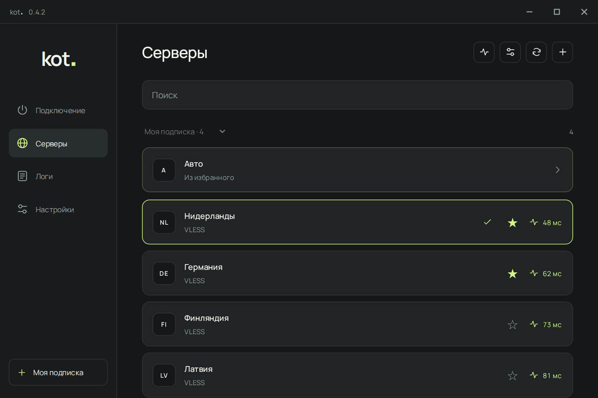
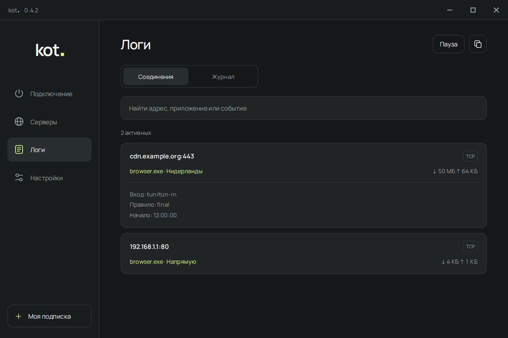

# kot.

Приложение для Windows на базе sing-box. Добавляешь подписку, выбираешь сервер и подключаешься.

**[Скачать для Windows](https://github.com/prodkot/kot/releases/latest)** · [Как пользоваться](docs/GUIDE.md) · [Что нового](CHANGELOG.md)

<picture>
  <source media="(prefers-color-scheme: dark)" srcset="docs/images/home-dark.png">
  <source media="(prefers-color-scheme: light)" srcset="docs/images/home-light.png">
  
</picture>

## Что внутри

- Несколько подписок, поиск серверов и избранное.
- Пинг одного сервера или всего списка. «Авто» выбирает быстрый доступный сервер.
- VLESS, VMess, Trojan, Shadowsocks и Hysteria2.
- Логи, текущие соединения и скорость скачивания и отправки.
- Светлая и тёмная темы, цвета на выбор, встроенный шрифт Manrope.
- Меню трея с быстрым доступом к серверам, логам и настройкам.
- Автозапуск, резервные копии и обновления с GitHub.

<details>
<summary>Серверы и соединения</summary>





</details>

*На скриншотах пример подписки. Серверы, соединения и значения скорости демонстрационные.*

## Начать пользоваться

1. Скачай установщик `Kot-Setup-…-Windows-x64.exe` из [Releases](https://github.com/prodkot/kot/releases/latest) и запусти его. Для версии без установки распакуй ZIP целиком и открой `Kot.exe`.
2. Нажми **+** и вставь ссылку на подписку или отдельный сервер.
3. Выбери сервер и нажми **Подключить**.

Нужна Windows 10 или 11, x64. Если нет WebView2, установи его через комплектный `Install-WebView2.exe`; ему нужен интернет. .NET отдельно ставить не нужно. Приложение запрашивает права администратора для сетевого туннеля.

kot. не продаёт подписки и не выдаёт серверы. Подписку нужно взять у своего провайдера.

Левый клик по иконке в трее открывает окно, правый открывает меню. Кнопка «Свернуть» оставляет приложение на панели задач. Если включено «Закрывать в трей», крестик скрывает окно, а соединение продолжает работать. Для полного выхода используй пункт в меню трея.

## Обновления

Официальные сборки уже настроены на `prodkot/kot`. Пока приложение запущено, оно проверяет обновления при старте и раз в сутки. Если в настройках включена автоматическая установка, новая версия скачивается и устанавливается сама.

Во время установки соединение ненадолго отключается. После перезапуска kot. пробует подключиться снова. Подписки, настройки и HWID сохраняются.

## Пока beta

Kill switch ещё нет: при падении ядра обычный интернет может остаться доступным. Проверки утечек и полного обновления на реальном Windows-компьютере ещё нужны. Подробности: [безопасность](SECURITY-AUDIT.md) и [что проверено](VALIDATION.txt).

## Собрать самому

Нужны Windows x64, .NET 10 SDK и PowerShell 7.

```powershell
pwsh ./build.ps1 -Repository "prodkot/kot"
```

[Сборка и тесты](docs/BUILD.md) · [Установщик и релизы на GitHub](Release/GITHUB.md) · [Обновления со своего VPS](Release/HOSTING.md)

Код kot. под [MIT](LICENSE.txt). У sing-box и других компонентов свои лицензии, они перечислены в [THIRD-PARTY.txt](THIRD-PARTY.txt).
