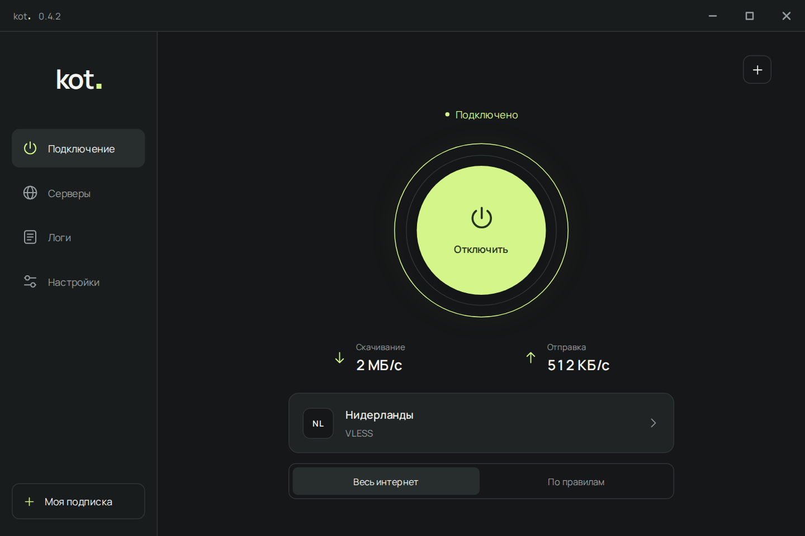

# kot.

VPN-клиент для Windows на базе sing-box. Добавь свою подписку, выбери сервер и подключись.

**[Скачать для Windows](https://github.com/prodkot/kot/releases/latest)** · [Сайт](https://prodkot.github.io/kot/) · [Руководство](docs/GUIDE.md) · [Что нового](CHANGELOG.md)

*Сервер, состояние подключения и показатели скорости на скриншоте приведены для примера.*

## Быстрый старт

1. Скачай установщик **Setup** из [последнего релиза](https://github.com/prodkot/kot/releases/latest) и установи kot.
2. Нажми **+** и вставь HTTPS-ссылку на свою подписку или ссылку на сервер.
3. Выбери сервер, режим подключения и нажми **Подключить**.

Нужна **Windows 10 или 11, x64**. Серверы и подписки нужно добавить самостоятельно.

## Возможности

- **Подписки и серверы:** несколько подписок, поиск, избранное и проверка пинга по HTTP или TCP.
- **Выбор «Авто»:** быстрый доступный сервер из избранного, а если оно пустое, из всего списка.
- **Работа в фоне:** автозапуск с Windows, автоподключение, переподключение после сбоя и закрытие в трей.
- **Мониторинг:** скорость скачивания и отправки, активные соединения и журнал приложения.
- **Оформление:** тёмная и светлая темы, четыре цвета акцента.
- **Обновления:** проверка релизов GitHub, установка после подтверждения с сохранением подписок и настроек.
- **Резервные копии:** экспорт и импорт профиля с защитой паролем.

Поддерживаются **VLESS, VMess, Trojan, Shadowsocks и Hysteria2**. Подписка может содержать обычный список ссылок на серверы или такой список в Base64.

## Режимы подключения

**TUN** направляет трафик приложений через виртуальный сетевой интерфейс. **Системный прокси** работает с приложениями, которые используют настройки прокси Windows. Прямые маршруты и различия режимов описаны в [руководстве](docs/GUIDE.md#режим-подключения).

**Kill switch** включается в настройках. При сбое подключения блокировка прямых соединений сохраняется. Ручное отключение соединения или обычный выход из приложения снимают защиту. Исключения и восстановление доступа описаны в [разделе о Kill switch](docs/GUIDE.md#kill-switch).

## Документация и участие

[Как пользоваться](docs/GUIDE.md) · [Сборка из исходников](docs/BUILD.md) · [Сообщить об ошибке](https://github.com/prodkot/kot/issues) · [Внести изменения](CONTRIBUTING.md) · [Безопасность](SECURITY.md)

Исходный код kot. распространяется под [лицензией MIT](LICENSE.txt). Лицензии включённых компонентов перечислены в [THIRD-PARTY.txt](THIRD-PARTY.txt).
